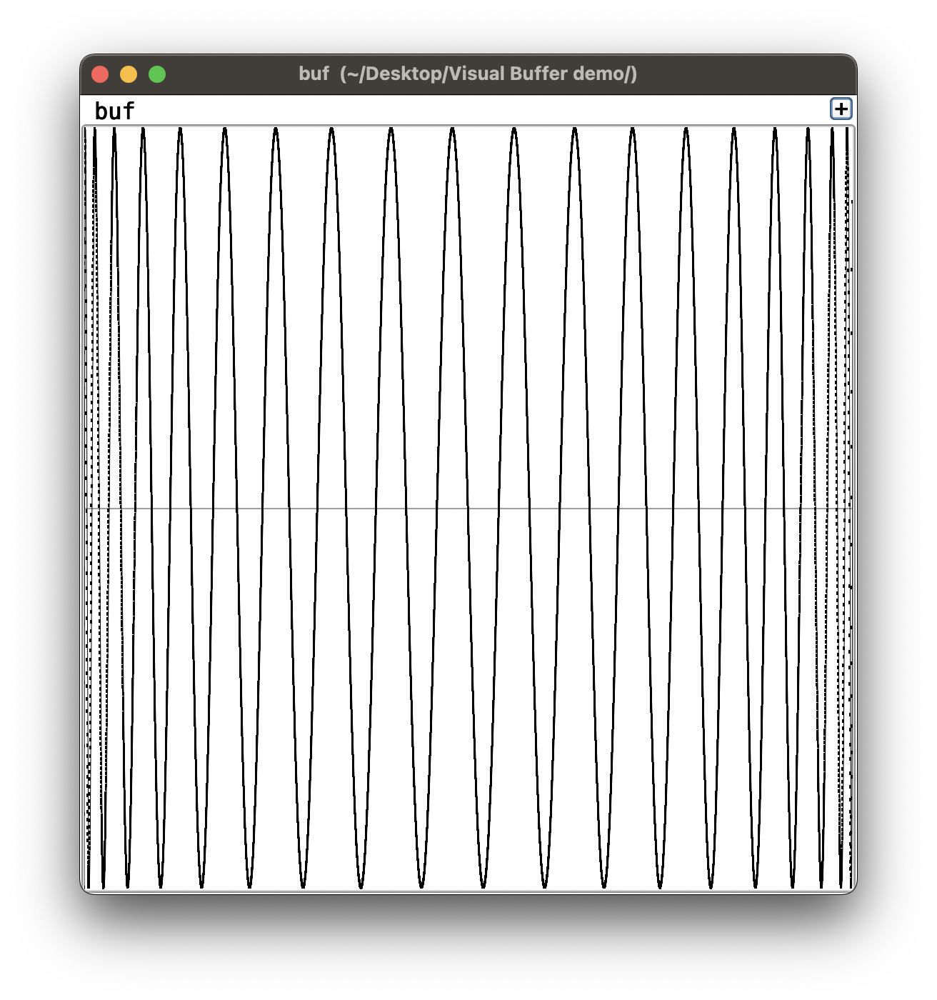
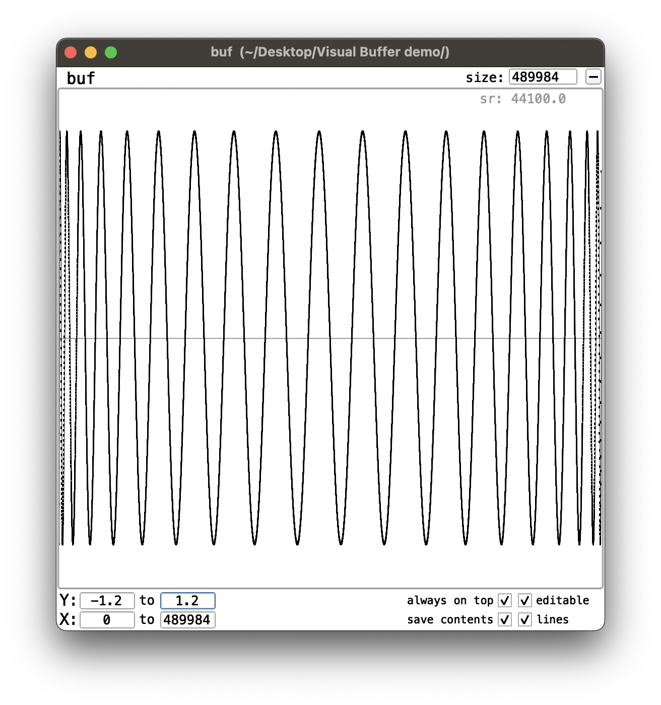

# VisualBuffer
Wrapper around a Buffer with editable GUI, drag/drop reading of sound files, Array-like data access, and automatic save/recall.

Heavily inspired by Pure Data arrays/tables, VisualBuffer is an attempt to bridge the client and server sides of a Buffer for a more integrated, intuitive and tactile experience.

VisualBuffer provides Array-style at and put commands as well as a GUI to visualize and edit the Buffer contents in real time. Additionally, the state of the GUI window and (optionally) the buffer contents themselves are saved automatically so the next time you open your project, everything will be the way it was.

This is done by saving a wav file and a text file in the directory of your .scd file under a folder called .cacheVB. Calling .delete on the VisualBuffer will remove these cache files.

See examples for a demonstration of its use, or watch https://www.youtube.com/watch?v=49kkbrzpqLQ

Note that:

- It's only built for single server use (VisualBuffer: *server).
- The buffer will be mono, a la Pd array. If you read or drag/drop a multichannel sound file, it will read the first channel by default.
- Most commands operate synchronously on .data. If you use one of the asynchronous methods (refresh, read, normalize, updateInfo, gen, sine1-3, cheby), the data will update itself momentarily but not instantaneously. In practice, I haven't had to worry about this.

NOTE: This project is a work in progress.
- I have not yet implemented x- and y-axis tick marks / legends.
- I have not yet implemented a View that can be incorporated into larger GUIs.
- I am considering adding applicable methods from Array, such as swap, replace, reverse, scramble, etc.
- As far as I know there is no way to manually update the sample rate of a Buffer on the server, therefore sampleRate should be taken with a little grain of salt. (i.e. if you read a file then resize the buffer, the sample rate will revert to the server's sample rate.) I am trying to find a way around that, e.g. by writing a temporary sound file and then reading it into the buffer.....
